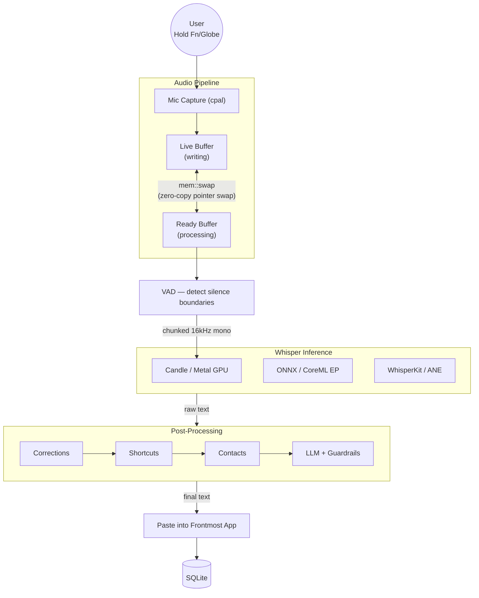

# Pulse

Local, privacy-first speech-to-text for macOS. Pulse runs speech recognition entirely on your machine using hardware-accelerated ML inference on Apple Silicon. No audio leaves your device, no cloud APIs required.

Record from your mic with a global hotkey, get transcribed text pasted directly into whatever app you're using.

## Inference Backends

Pulse supports three inference backends, each leveraging different Apple Silicon acceleration paths. You can switch between them depending on your latency and accuracy requirements.

### Whisper via Candle (Metal GPU)

Runs OpenAI's Whisper models through Candle, a pure-Rust ML framework. Inference executes directly on the Metal GPU via Apple's Metal Performance Shaders, with the Accelerate framework handling linear algebra operations. No Python runtime, no external dependencies -- compiled Rust calling the GPU directly.

The model stays loaded in GPU memory across transcriptions. Only the initial load incurs latency; subsequent transcriptions start immediately.

Available model tiers:

| Model | Parameters | Notes |
|-------|-----------|-------|
| Tiny (Fast) | 39M | Lowest latency, good for short utterances |
| Base (Balanced) | 74M | Good accuracy with fast inference |
| Small (Quality) | 244M | Higher accuracy, moderate latency |
| Medium | 769M | Near-best accuracy |
| Large v3 | 1.5B | Best accuracy, highest latency |
| Large v3 Turbo | 1.6B | Optimized large model architecture |
| Distil Large v3.5 | 1.5B | Distilled for speed with large-model quality |

### Moonshine via ONNX Runtime (CoreML Execution Provider)

The Moonshine backend runs the `moonshine-base` model through ONNX Runtime configured with the CoreML execution provider. CoreML automatically dispatches computation across the CPU, GPU, and Apple Neural Engine (ANE) based on what the hardware supports and what yields the best throughput.

Moonshine is built for low-latency short-form transcription. It processes a 5-second audio chunk in roughly 50-250ms, compared to several seconds with Whisper on the same hardware. It also accepts variable-length input without padding, avoiding wasted computation on silence.

### WhisperKit via CoreML (Apple Neural Engine) -- Default

The default backend. Compiles Whisper models into CoreML format using WhisperKit, a Swift framework from Argmax. The compiled models run natively on the Apple Neural Engine, which is purpose-built silicon for transformer inference and sits idle during most other workloads. Pulse defaults to the Large v3 model for best accuracy.

CoreML model compilation happens once on first use (takes 1-2 minutes, produces ~3GB of compiled model assets). After that, model loading is fast. Pulse communicates with a Swift helper process (`pulse-whisper-coreml`) over a text protocol to bridge the Rust/Swift boundary.

## How It Works



Audio is captured via `cpal` into pre-allocated double buffers (zero heap allocations in the recording loop). An energy-based VAD with hysteresis detects utterance boundaries, splitting audio into chunks that are transcribed in parallel while the user is still speaking. Each chunk is converted to mono, resampled to 16kHz, and passed to whichever inference backend is active.

Raw transcriptions pass through five post-processing stages: learned corrections, shortcut expansion, contact name resolution, context-aware formatting (adapts style to the frontmost app), and optional LLM polishing with guardrail validation.

Transcription history, corrections, shortcuts, and settings persist in a local SQLite database at `~/.local/share/pulse/pulse.db`.

## Desktop App

Pulse includes a Tauri-based desktop application with a TypeScript frontend (Vite + Tailwind CSS). The app provides model/provider selection, recording controls, settings management, and transcription history.

The global Fn/Globe hotkey works from any application. Hold to record, release to transcribe and paste. A floating indicator overlay shows recording state with waveform visualization.

## Building

Requires macOS with Apple Silicon (M1 or later).

```bash
# Build the core library and CLI
cargo build --release

# Build the Tauri desktop app
cd src-tauri && cargo build --release
```

Release mode is critical. Debug builds run inference roughly 10x slower due to missing compiler optimizations.

## Usage

### CLI

```bash
# Interactive push-to-text (default: CoreML + Large v3 + paste mode)
cargo run --release

# Disable paste mode (print to stdout instead)
cargo run --release -- --no-paste

# Transcribe a WAV file
cargo run --release -- --file recording.wav

# Select model tier
cargo run --release -- --model fast|balanced|quality|medium|large|turbo|distil

# Select inference backend
cargo run --release -- --provider whisper|moonshine|coreml
```

Paste mode is on by default -- transcribed text is pasted directly into the frontmost app. Use `--no-paste` to print to stdout instead. All status output goes to stderr, so Pulse composes cleanly with pipes:

```bash
cargo run --release -- --no-paste --file recording.wav 2>/dev/null | pbcopy
```

## Project Structure

```
crates/pulse-core/        Core library: audio capture, inference backends, post-processing, storage
  src/audio/              Mic capture (cpal), VAD, resampling
  src/providers/          Whisper (Candle/Metal), Moonshine (ONNX/CoreML), WhisperKit (CoreML/ANE)
  src/engine/             Formatter, learning, shortcuts, contacts, mode detection
  src/platform/           macOS integration: hotkey, paste, app detection, accessibility
  src/storage/            SQLite persistence and migrations

src-tauri/                Tauri desktop app (Rust backend, IPC commands, background worker)
src/                      Frontend (TypeScript, Vite, Tailwind CSS)
```

The core library is independent of the desktop app and works as a standalone Rust crate or CLI tool. The Tauri app imports it as a dependency.

## Benchmarks

Measured on Apple M3 Pro with VAD-chunked transcription of 7 natural sentences (~31s of speech, 101 words). Both backends use the Large v3 (1.5B parameter) model.

| Metric | Whisper/Candle (Metal GPU) | WhisperKit/CoreML (ANE) |
|--------|---------------------------|-------------------------|
| Total inference time | 10.7s | 8.8s |
| Final chunk latency | 1547ms | 1084ms |
| Avg chunk latency | 1526ms | 975ms |
| Real-time factor (RTF) | 0.34x | 0.28x |
| Effective RTF (user wait) | 0.049x | 0.034x |
| Word accuracy | 98.3% | 98.0% |

**RTF** is total inference time divided by total speech duration. **Effective RTF** is the user-perceived wait -- only the final chunk's latency matters, since earlier chunks are transcribed in parallel while the user is still speaking.

## Tests

```bash
# Unit tests (no external dependencies)
cargo test --release

# Integration tests (downloads models on first run)
cargo test --release -- --ignored --nocapture

# Single integration test
cargo test --release test_e2e_with_tts -- --ignored --nocapture
```

Integration tests are `#[ignore]` because they require downloading models from HuggingFace on first run. The TTS test also requires macOS (`say` + `afconvert`).

## Requirements

- macOS with Apple Silicon (M1/M2/M3/M4)
- Rust (2024 edition for pulse-core, 2021 for src-tauri)
- Microphone access (grant permission when prompted)
- Disk space for models (auto-downloaded on first use):
  - Whisper: ~39MB to ~3GB depending on model tier
  - Moonshine: ~300MB
  - CoreML/WhisperKit: ~3GB compiled assets

## Key Dependencies

| Crate | Purpose |
|-------|---------|
| `candle-core`, `candle-nn`, `candle-transformers` | Pure-Rust ML framework with Metal GPU and Accelerate support |
| `ort` | ONNX Runtime bindings with CoreML execution provider |
| `cpal` | Cross-platform audio capture |
| `hf-hub` | HuggingFace Hub API for model downloads |
| `tokenizers` | Tokenization for Whisper and Moonshine models |
| `rusqlite` | SQLite persistence |
| `tauri` | Desktop application framework |
